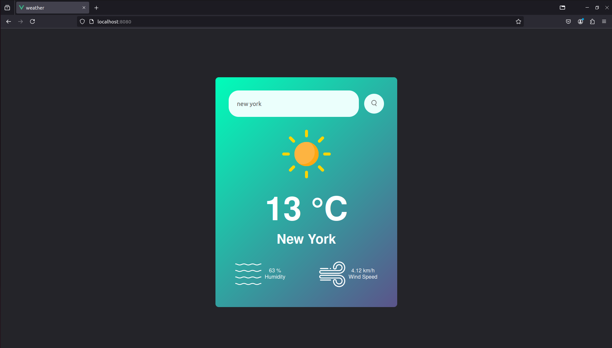

# weather-app 🌤️

This is a simple weather forecasting application built using Vue.js. It allows users to enter the name of a city and receive real-time weather information such as temperature, humidity, wind speed, and an appropriate weather icon. The data is fetched from the OpenWeatherMap API.

## Demo

## Features
- Search for current weather conditions by city.
- Displays temperature, humidity, wind speed, and city name.
- Dynamically updates the weather icon based on the current weather (clear, rain, clouds, etc.).
- Handles error messages when a city is not found.

### Technologies Used:

- Vue 3 with Composition API.
- OpenWeatherMap API for real-time weather data.

## 🚀 About Me
- [@nforoutann](https://github.com/nforoutann)
I'm a Computer Engineering (Computer Science) student at Shahid Beheshti University.

